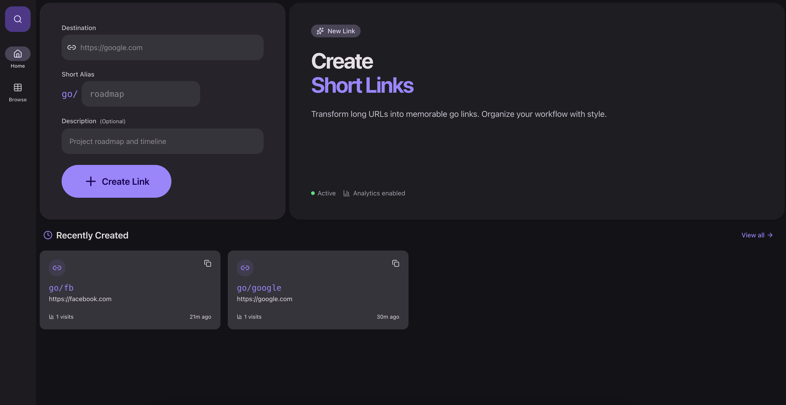
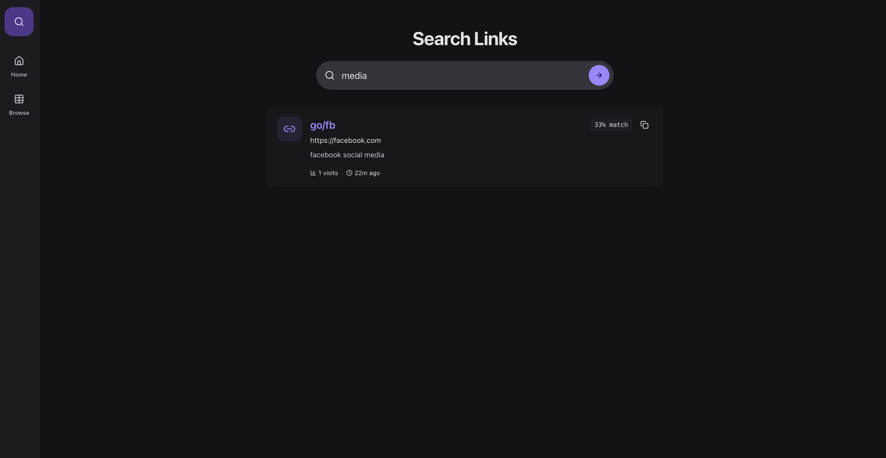

# Go Links

A modern, intelligent URL shortener for your internal tools and resources. Create memorable `go/` links, track usage, and find what you need with semantic search.



## Features

- 🚀 **Smart Shortening**: Create custom `go/alias` links for any URL.
- 🧠 **Semantic Search**: Can't remember the exact alias? Search by description or concept using our AI-powered vector search.
- 📊 **Analytics**: Track visit counts for every link to understand usage patterns.
- 🎨 **Modern UI**: Built with Material 3 Expressive design principles for a beautiful, responsive experience.
- ⚡ **High Performance**: Powered by Next.js 16 and Bun.

## Semantic Search

Semantic search allows you to find links even if you don't remember the exact alias. By embedding descriptions and keywords, we can match your query to the most relevant links.



## Tech Stack

- **Framework**: [Next.js 16](https://nextjs.org/) (App Router)
- **Language**: TypeScript
- **Styling**: [Tailwind CSS v4](https://tailwindcss.com/) & [Shadcn UI](https://ui.shadcn.com/)
- **Database**: PostgreSQL with `pgvector` extension
- **ORM**: [Drizzle ORM](https://orm.drizzle.team/)
- **AI/ML**: Local embeddings with [@xenova/transformers](https://huggingface.co/docs/transformers.js/index)

## Prerequisites

- **Docker** & **Docker Compose** (for the database)
- **Node.js** (v20+) or **Bun**

## Getting Started

### 1. Clone the repository

```bash
git clone <repository-url>
cd go-links
```

### 2. Start the Database

Start the PostgreSQL instance with `pgvector` enabled:

```bash
docker-compose up -d
```

### 3. Install Dependencies

```bash
npm install
# or
bun install
```

### 4. Setup Database Schema

Generate and apply the database migrations:

```bash
npm run db:generate
npm run db:migrate
```

### 5. Run the Development Server

```bash
npm run dev
# or
bun dev
```

Open [http://localhost:3000](http://localhost:3000) with your browser to start creating links.

## Project Structure

- `app/`: Next.js App Router pages and API routes.
    - `page.tsx`: Main dashboard for creating links.
    - `[short_code]/`: Dynamic route for handling link redirects.
    - `-/browse/`: Page to browse all created links.
    - `-/search/`: Semantic search interface.
    - `-/api/`: Backend API endpoints.
- `lib/db/`: Database configuration and Drizzle schema.
- `components/`: Reusable UI components.
- `drizzle/`: Database migration files.

## Database Management

This project uses Drizzle Kit for database management.

- **Generate Migrations**: `npm run db:generate`
- **Apply Migrations**: `npm run db:migrate`
- **Drizzle Studio**: `npm run db:studio` (Opens a GUI to manage data)

## License

MIT
